# Create new Salesforce opportunities using Microsoft Forms, approve in Salesforce and approval log on blockchain

Displaying the integration between Forms, Salesforce and Ethereum blockchain using Logic Apps.
Sales reps can use Microsoft Forms to create a new discounted deal in Salesforce. Discounts larger than 40% will have to be approved by sales region manager using approval process in Salesforce. To ensure immutability, approval steps are logged on Ethereum blockchain using Logic Apps and Ethereum Blockchain connector.

---

## Prerequisites  
1. Office365 developer account
2. Azure account
3. Salesforce developer account - [register for a trial](https://developer.salesforce.com/signup)

--- 

## Forms

1. Navigate to `http://forms.office.com` and create a new form called eq. `Add opportunity` or [make a duplicate of this example](https://forms.office.com/Pages/ShareFormPage.aspx?id=LKtUoszetEi7u0Gj14MFu4k0f71m5RhMrDXVzbOrZBJUQVRCSlNJQ1RCSEVEMDk1MDUwQlo3T1NEUC4u&sharetoken=AFpKcmG9UJml40z89TBd)
- If you are building your own the following questions (as shown on the image)
    - Name as **Text**
    - Amount as **Text** with Number restriction
    - Discount Percent **Text** with Number restriction 
    - Close Date as **Date**

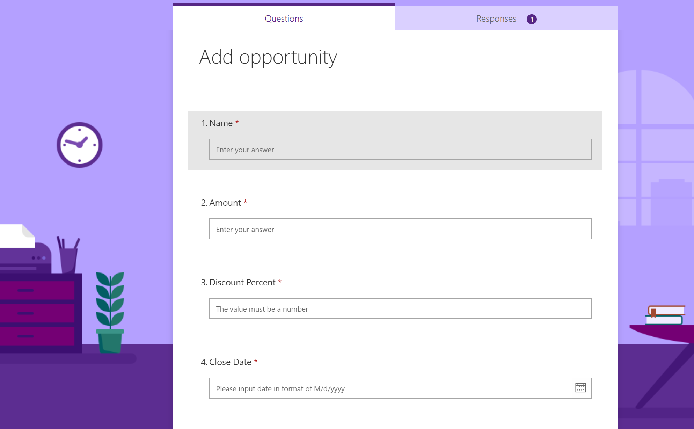

--- 

## Salesforce

1. For this example, we will be customizing standard Opportunity entity to
- Add Discount Percent field
- Discount Percent Status field
- Approval process if the Discount Percent is more than 40%

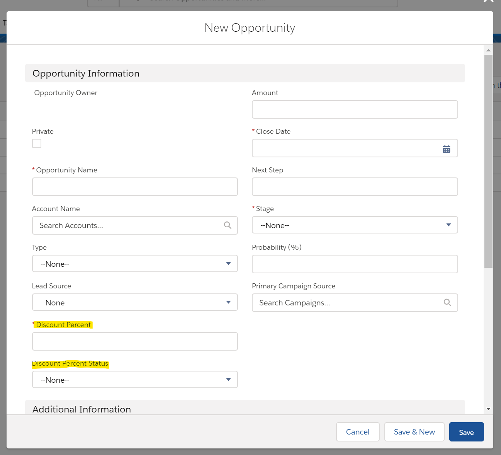

In case you are new to Salesforce, use this [this step-by-step guide](https://trailhead.salesforce.com/en/content/learn/modules/business_process_automation/approvals) to complete all those steps.

*Note*: Make sure you set up a default approver

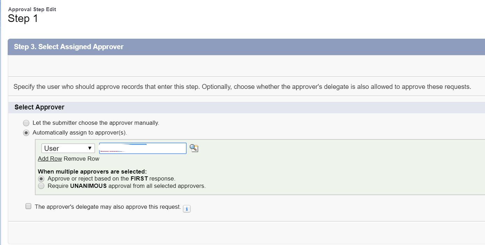

--- 

## Smart Contract

1. Create a private Ethereum network
    - You can choose to create a private Ethreum POA network from scratch as described in [this guide](https://github.com/caleteeter/smartcontractdev/blob/master/example1-setup.md)
    - or use an existing template on Azure Marketplace
2. Deploy the `Approval.sol` located in `contracts`
    - Deploy the smart contract to you Ethereum network by using truffle as described in [this guide](https://github.com/caleteeter/smartcontractdev/blob/master/walkthrough1.md) or by using [Remix IDE](https://remix.ethereum.org)
    - Take a note of the **contract address** and **ABI** as we will need them to connect to the smart contract
    - Take a note of the private key of the account


`Approval` smart contract defines `ApprovalLog` struct with the following fields
```
    struct ApprovalLog {
        uint Id;        
        bytes32 OpportunityHash;
        bytes32 ActorIdHash;
        string Date;
        string Status;      
    }
```
Smart contract emits the following event
```
    event ApprovalLogAdded(uint id, bytes32 opportunityHash, bytes32 actorIdHash, string date, string status);
```

It exposes the following methods
- `addLog` is used to add a new approval log to the blockchain and emit `ApprovalLogAdded` event
- `getCount` to return the number of expenses logged

```
    function addLog(bytes32 opportunityHash, bytes32 actorIdHash, string memory date, string memory status) public {
        uint id = LogCount++;

        ApprovalLog memory doc = ApprovalLog({
            Id : id,
            OpportunityHash : opportunityHash,
            ActorIdHash : actorIdHash,
            Date : date,
            Status : status
        });
        
        ApprovalLogs[id] = doc;                        

        emit ApprovalLogAdded(id, opportunityHash, actorIdHash, date, status);
    }

    function getCount() public view returns (uint) {
        return LogCount;
    }
```

---

## Azure Function for hashing

1. Create a Function App from Azure Marketplace on Azure Portal


2. Add new function and select In-portal tile on the Quick start


3. Choose Webhook + API tile to create an function triggered on HTTP request


4. Use the code provided in `hashfunction.csx` file to create an azure function which will hash the request body

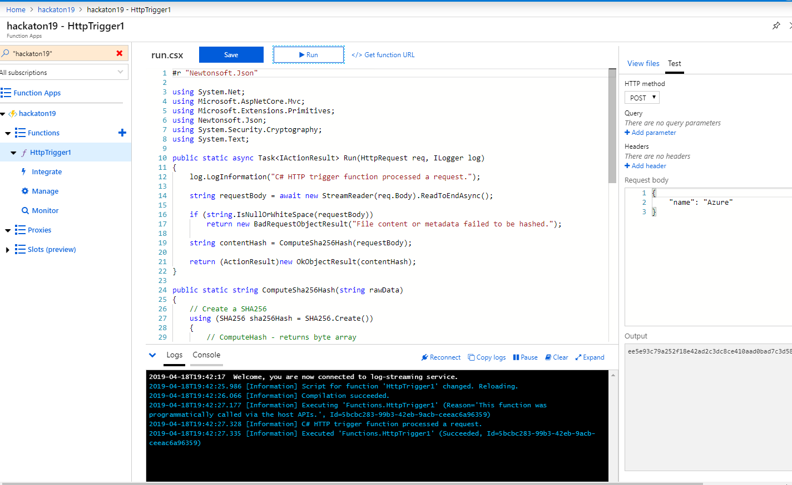


--- 

## Create Salesforce opportunity from Forms using Logic Apps

1. Create a new **Logic App** in Azure Portal and use Blank Logic App template    
2. Search for **Microsoft Forms** connector
3. Choose **When a new response is submitted** trigger
4. Select your form from the dropdown eq. `Add opportunity`

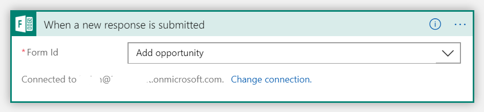

5. Add **Microsoft Forms** one more time and select **Get response details** action
6. Select `Add opportunity` form and **List of response notifications Response Id** from the dynamic content panel

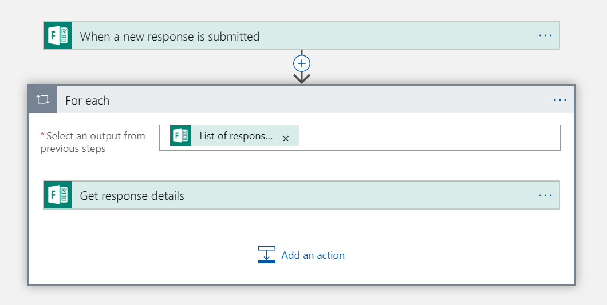

7. In the foreach section, add new **Salesforce** connector and select **Create record** action

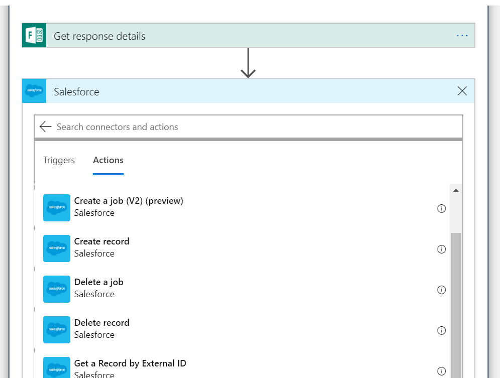

8. Fill the parameters as shown on the image

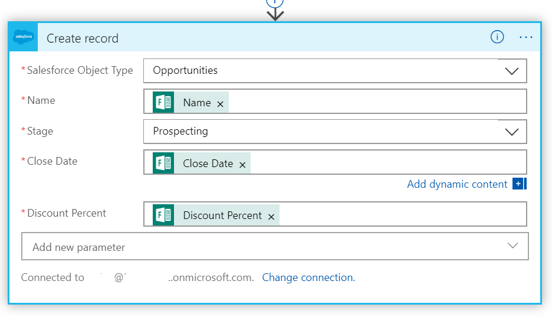

9. Save and run the logic app

---

## Listen for approval requests from Salesforce and log changes to blockchain using Logic Apps

1. Next, we will create another **Logic App** in Azure Portal and use Blank Logic App template

2. Add **Salesforce** connector and select **When a record is modified** trigger
3. Select **Process Instance Step** Object Type

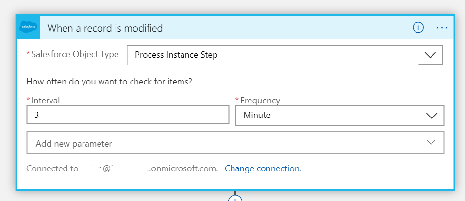

4. Add another **Salesforce** connector and select **Get a record** action
5. Select **Process Instance** Object Type
6. For Record Id select **Process Instance ID** from dynamic content

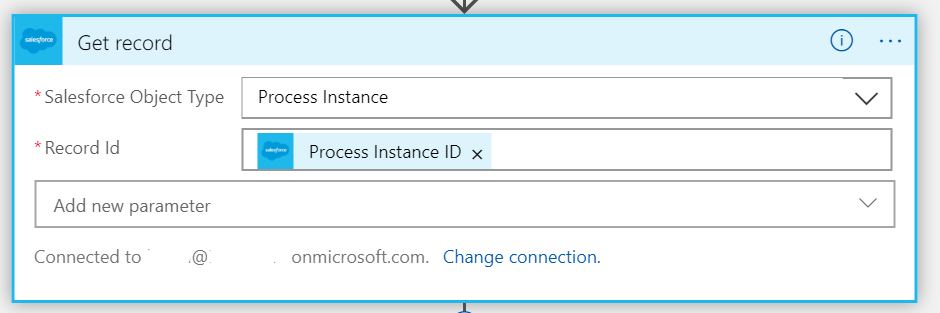

4. Once more, add **Salesforce** connector and select **Get a record** action
5. Select **Opportunities** Object Type
6. For Record Id select **Targert Object ID** from dynamic content

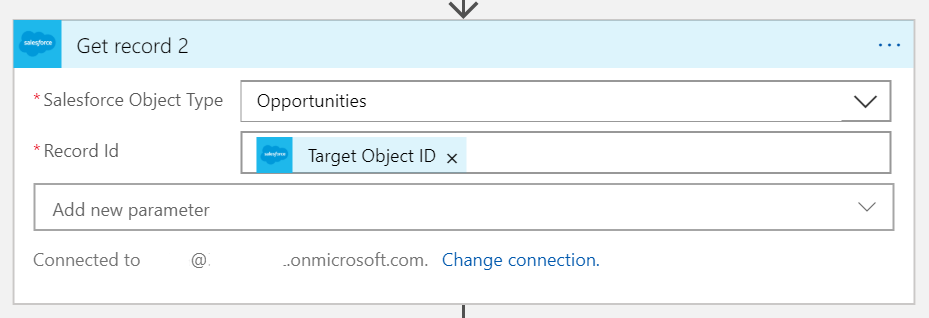

7. Add **Azure Function** connector
8. Select the hash function you created


9. The purpose of this step is to create a hash of the opportunity content. Add all the fields you want to store (as hash) on the blockchain eq. as shown on the image

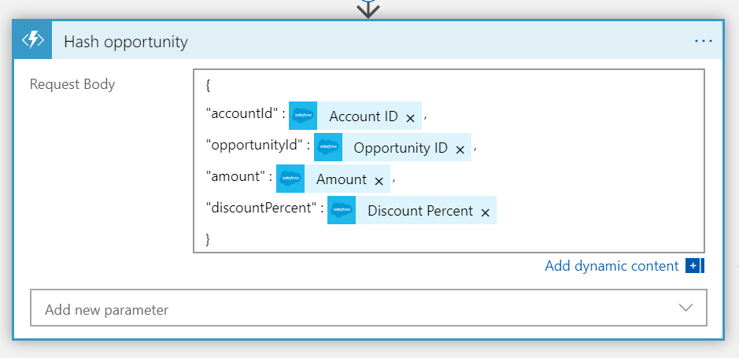

10. Next, add another **Azure Function** connector and select the hash function
11. We will hash the ID od the user in the approval workflow

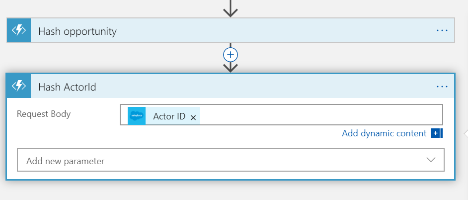

12. Finally, add **Ethereum blockchain connector** and select **Execute smart contract function**
13. Create a new connection to Ethereum RPC endpoint
    - Enter a connection name
    - Put a RPC endpoint eq. `http://your_ip:port`
    - Paste a private key of the account from your Ethreum network
14. Paste **ABI** you stored earlier
15. Paste address contract has been deployed to
16. Select name of the function from the dropdown eq. `addLog`
17. In the boxes use dynamic content to fill in the parameters
- Select **Body** of the **Hash opportunity** step for **opportunityHash** parameter
- Select **Body** of the **Hash ActorId** step for **actorIdHash** parameter
- Select **Ssytem Modstamp** for **date** parameter
- Select **Discount Percent Status** for **status** parameter

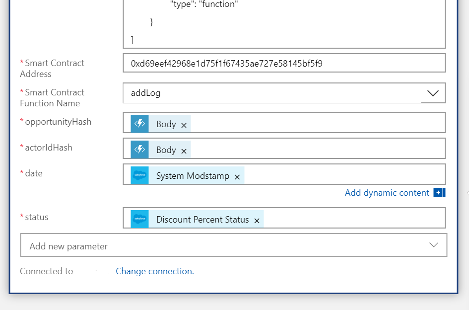

18. Save and run the logic app

---

## Testing

To verify everything is working correctly
1. Fill in the `Add opportunity` form and submit it
2. Navigate to Logic App in Azure portal to check the run history and inspect the inputs and outputs of each step

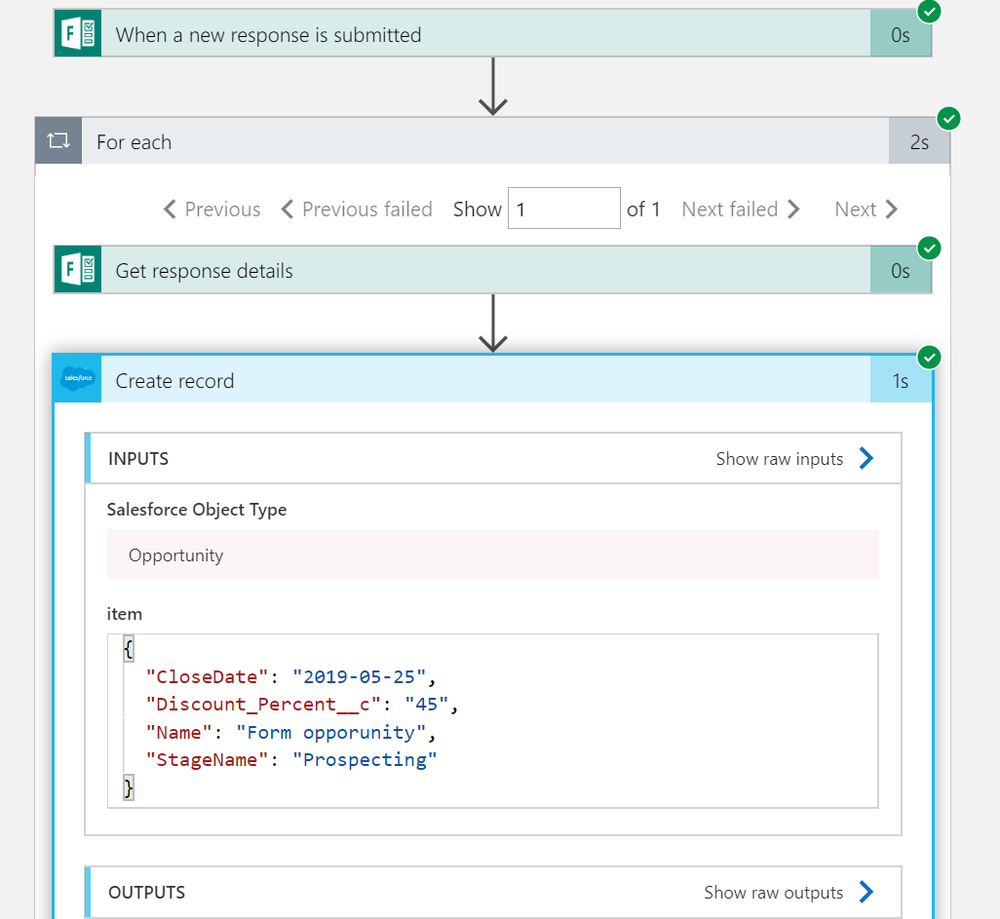

3. Check mailbox of default approver for the approve notification
4. Next, navigate to Salesforce and notice that a new opportunity has been created
5. Notice that in the **Approval History** there is a approval request

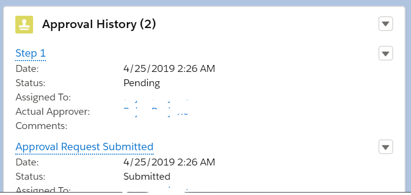

6. Approve or reject the request
7. Move back to Azure portal and open the Logic App which listens to changes on the approval request
8. Inspect the run history and review the steps

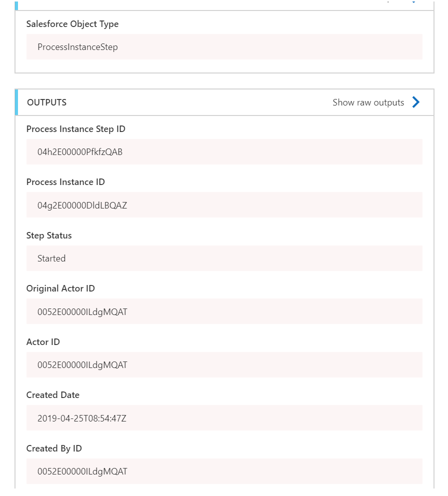

9. Check the blockchain connector step

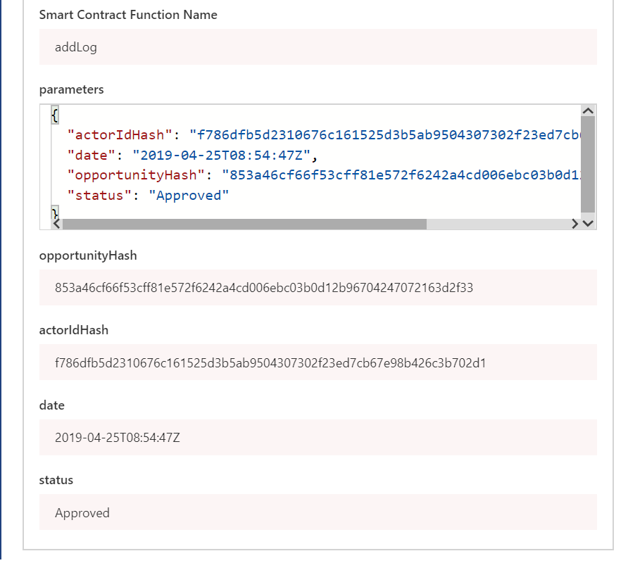
