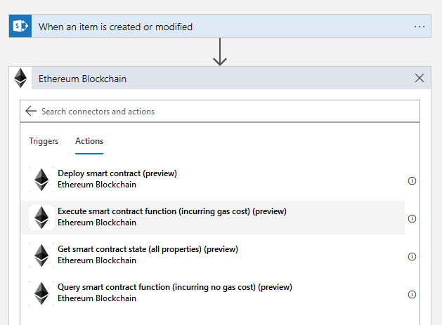
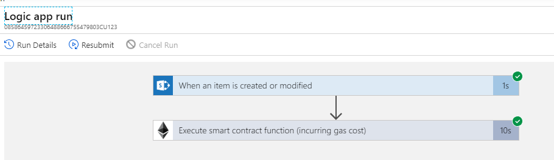
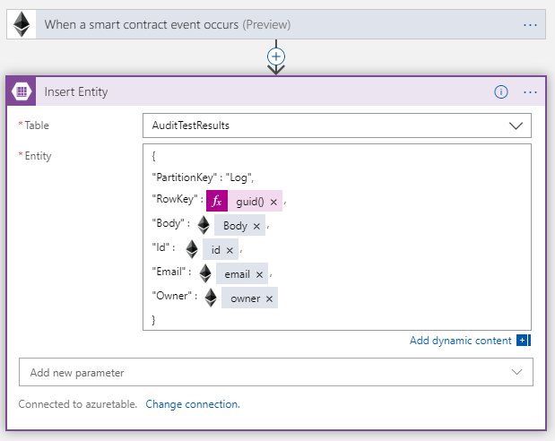

# Simple auditing of changes to SharePoint list items on Ethereum blockchain

This sample is intended to showcase the usage of Ethereum blockchain as immutable log in auditing purposes to keep track of changes made on the SharePoint list.
We will be tracking Id of the modified item, modified date, email and display name of the user making changes and storing it on the blockchain. 

---
## Requirements 
1. Office365 developer account
2. Azure account

## SharePoint list

1. SharePoint site
    - In case you already have a SharePoint site set-up, note the site URL.
    - Otherwise, navigate to `https://your_org.sharepoint.com` as a site collection admin and Create site
    - Chose team site and add site name eq. `AuditTrace`
    - Copy the URL of the team site eq. `https://your_org.sharepoint.com/sites/AuditTrace`

2. Create a list
    - Navigate to Setting and choose Add an app
    - Select Custom list template and add a name eq. `Suggestions`
    - Add additional columns you want your list to have

---

## Smart Contract

1. Create a private Ethereum network
    - You can choose to create a private Ethreum POA network from scratch as described in [this guide](https://github.com/caleteeter/smartcontractdev/blob/master/example1-setup.md)
    - or use an existing template on Azure Marketplace
2. Deploy the AuditLog.sol
    - Deploy the `AuditLog.sol` smart contract to you Ethereum network by using truffle as described in [this guide](https://github.com/caleteeter/smartcontractdev/blob/master/walkthrough1.md) or by using [Remix IDE](https://remix.ethereum.org)
    - Take a note of the **contract address** and **ABI** as we will need them to connect to the smart contract
    - Take a note of the private key of the account

---

## Logic app

1. Create a new **Logic App** in Azure Portal and use Blank Logic App template
    
    
2. Search for SharePoint connector
2. Choose **When an item is created or modified** trigger
3. Paste SharePoint site URL eq. `https://your_org.sharepoint.com/sites/AuditTrace`
4. Select List name from the dropdown eq. `Suggestions`
5. Add a new step
6. Select Ethereum Blockchain connector
7. Chose **Execute smart contract function** from the list of supported actions

8. Create a new connection to Ethereum RPC endpoint
    - Enter a connection name
    - Put a RPC endpoint eq. `http://your_ip:port`
    - Paste a private key of the account from your Ethreum network
9. Paste **ABI** you stored earlier
10. Paste address contract has been deployed to
11. Select name of the function from the dropdown eq. `addLog`
12. In the boxes use dynamic content to fill in the parameters

---

## Verify
To verify everything is set correctly
1. Navigate to SharePoint list and add a new item or modify an existing one
2. Navigate to Logic App in the portal and click on the run history
3. Inspect the inputs and outputs of each step
4. Copy the transaction hash from the output section and verify that it has been confirmed and the event has been raised

### Bonus - Log events in Azure Table Storage for easy access
Additionally, for easy access you create a Logic App which will listen for events raised on smart contracts and store the output in a Table storage.
1. Create a new logic app (from black template)
2. Select a Blockchain Connector
3. Use the existing connection string from previus steps
3. Select trigger *When a smart contract event occurs*
4. Add new step with *Azure Table Storage connector*
5. Select *Insert Entity* action
6. Choose a Storage table from the dropdown
7. Create an entity with a JSON as on the image

