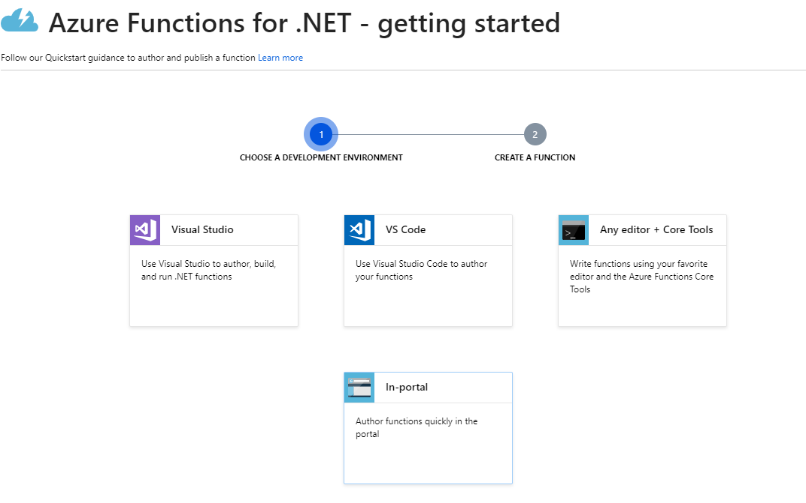

# Attested delivery

Displaying the enhancement of the traditional delivery scenario with immutable log of the delivery on Ethereum blockchain.
1. Dispatcher is using Forms to schedule a delivery to the customer. 
2. Delivery person retrieves a list of deliveries for the date in a mobile app and goes on to deliver a package.

App provides the user with directions to delivery address and ability to notify the customer that the truck is on the way.

When on site, delivery person uses the mobile app to retrieve GPS coordinates, scan the barcode on the package, take a photo as a proof of delivery and collect a signature from customer.

Mobile app is developed using Xamarin.Forms, which enables building native apps for Android, iOS and Windows.

Technologies used for backend implementation are Azure Functions, Logic Apps and Azure Storage.

To ensure immutability, we are using Ethereum blockchain to keep a track of 
- DeliveryId
- Hash of the delivery details stored in Azure Storage Table
- Hash of the photo of the delivery which is stored in Azure Storage Blob
- Hash of the signature of customer contact person confirming the delivery, stored in Azure Storage Blob
- Date of delivery

---

## Prerequisites  
1. Office365 developer account
2. Azure account
3. Visual Studio with Xamarin and Android emulator or smartphone with development mode turned on

--- 

## Schedule the delivery using Forms

1. Navigate to http://forms.office.com and create a new form called eq. `Schedule delivery` or [make a duplicate of this example](https://forms.office.com/Pages/ShareFormPage.aspx?id=LKtUoszetEi7u0Gj14MFu4k0f71m5RhMrDXVzbOrZBJUNzhZTllEWkhOOTFYSU1HNzRFQTdQQjE3Ni4u&sharetoken=23gtuhDUvsoGbmwydbmu)
- If you are building your own the following questions (as shown on the image)
    - PackageId as **Text** to represent unique identifier of the delivery
    - Name as **Text** to represent customers name
    - Phone as **Text** to represent phone number of a contact person
    - Address as **Text**
    - City as **Text**
    - State as **Text**
    - Zipcode as **Text**
    - TruckId as **Text** representing unique identifier of the delivery truck in the system
    - Delivery Date as **Date**
    - Timeslot as **Choice** representing time of day for delivery


--- 


## Schedule Deliveries from Forms using Logic Apps

1. Create a new **Logic App** in Azure Portal and use Blank Logic App template    
2. Search for **Microsoft Forms** connector
3. Choose **When a new response is submitted** trigger
4. Select your form from the dropdown eq. `Schedule delivery`


5. Add **Microsoft Forms** one more time and select **Get response details** action
6. Select `Schedule delivery` form and **List of response notifications Response Id** from the dynamic content panel
7. In the foreach section, add new **Azure Storage Table** connector and select **Insert Entity** action
8. Fill the parameters as shown on the image


9. Save and run the logic app

--- 


## Retrieve scheduled deliveries for a specific truck using Azure Function

1. Create a Function App from Azure Marketplace on Azure Portal


2. This time we will be using Visual Studio (or Visual Studio Code) to deploy custom built Azure function. Open the `Delivery.Functions` solution in `backend` and inspect `GetMyDeliveries` function, which
- Gets `truckId` and `date` from request query
- Queries the `ScheduledDeliveries` Azure Storage Table to retrieve the entities with that have `PartitionKey = date`  and `TruckId = truckId` from request
- Maps table entities `DeliveryEntity` to model `DeliveryAttestation` and returns as JSON

3. Publish to Azure Function from Visual Studio


3. Create publish profile by logging in with your account and selecting Azure function you created


---

## Xamarin.Forms mobile app

Delivery personnel will be using a mobile app to collect all necessary information about successful delivery.

1. Open the `DeliveryApp` solution located in `client` with Visual Studio
2. Locate `Settings.cs` and
- Replace `StorageConnectionString` with the connection string of your Azure Storage
- Replace `GetDeliveriesUrl` to contain the URL of your Azure Function
- Replace `CompleteDeliveryUrl` to contain URL of your Logic App HTTP trigger
3. Build and deploy the app to your device or emulator

Solution contains 
- DeliveryApp.Model project which contains `DeliveryAttestation` model, reused on client and backend
- DeliveryApp project containing cross-platform pages and viewmodels
- DeliveryApp.Android which builds the Android app

Our view are located in Delivery app library
- `DeliveryPage` - a Master-Detail page
- `DeliveryPageMaster` - shows a list of scheduled deliveries for today for a specific truck (defined in `SessionState`) with pull to refresh functionality. Logic to retrieve data backend (Azure function) and display it for the user is in `DeliveryPageMasterViewModel`.
- Once a user selects a delivery, `DeliveryPageDetails` page opens, allowing user to 
    - View all details about the delivery including name of the customer, address and phone number of the contact person
    - User is able to notify the customer that the delivery its on its way by sending a predefined text message by using **SmsMessage** from [Xamarin.Essentials](https://docs.microsoft.com/en-us/xamarin/essentials/)
    - User is able to get directions and navigation to delivery address in map app by using [External maps plugin](https://github.com/jamesmontemagno/LaunchMapsPlugin)
    - In order to confirm the delivery, user must:
        - Get the current GPS coordinates using **Geolocation** from [Xamarin.Essentials](https://docs.microsoft.com/en-us/xamarin/essentials/)
        - Scan the QRcode/barcode using [ZXing.Net.Mobile library](https://github.com/Redth/ZXing.Net.Mobile)
        - Take a photo of the delivery using [Media Plugin for Xamarin and Windows](https://github.com/jamesmontemagno/MediaPlugin)
        - Collect the signature from customer contact person confirming the delivery using [Signature Pad](https://github.com/xamarin/SignaturePad)
- Once all data is collected, user clicks Complete to
    - Upload photo to Azure Storage Blob to images container
    - Upload signature to Azure Storage Blob to signatures container
    - Post all collected info to Logic app which will store it Azure Storage Table and Ethereum blockchain

--- 

## Smart Contract

1. Create a private Ethereum network
    - You can choose to create a private Ethreum POA network from scratch as described in [this guide](https://github.com/caleteeter/smartcontractdev/blob/master/example1-setup.md)
    - or use an existing template on Azure Marketplace
2. Deploy the `AttestableDelivery.sol` located in `contracts`
    - Deploy the smart contract to you Ethereum network by using truffle as described in [this guide](https://github.com/caleteeter/smartcontractdev/blob/master/walkthrough1.md) or by using [Remix IDE](https://remix.ethereum.org)
    - Take a note of the **contract address** and **ABI** as we will need them to connect to the smart contract
    - Take a note of the private key of the account

`AttestableDelivery` smart contract defines `DeliveryLog` struct with the following fields
```
    struct DeliveryLog {
        uint DeliveryId;
        bytes32 PhotoHash;
        bytes32 DetailsHash;
        bytes32 SignatureHash;
        string Date;
    }
```
Smart contract emits the following event
```
    event DeliveryLogAdded(uint deliveryId, bytes32 photoHash, bytes32 detailsHash, bytes32 signatureHash, string date);
```

It exposes the following methods
- `addLog` is used to add a new delivery log to the blockchain and emit `DeliveryLogAdded` event
- `getCount` to return the number of deliveries logged

```
    function addLog(uint deliveryId, bytes32 photoHash, bytes32 detailsHash, bytes32 signatureHash, string memory date) public {
        uint id = LogCount++;

        DeliveryLog memory doc = DeliveryLog({
            DeliveryId : deliveryId,
            PhotoHash : photoHash,
            DetailsHash : detailsHash, 
            SignatureHash : signatureHash,
            Date : date            
        });
        
        DeliveryLogs[deliveryId] = doc;                        

        emit DeliveryLogAdded(deliveryId, photoHash, detailsHash, signatureHash, date);
    }

    function getCount() public view returns (uint) {
        return LogCount;
    }
```

---

## Azure Function for hashing

1. Create a Function App from Azure Marketplace on Azure Portal


2. Add new function and select In-portal tile on the Quick start



3. Choose Webhook + API tile to create an function triggered on HTTP request


4. Use the code provided in `logicapps\hashfunction.csx` file to create an azure function which will hash the request body


---

## Store delivery attestation from mobile app and log delivery info to blockchain using Logic Apps

We will be creating a logic app with the following steps:


1. Create another **Logic App** in Azure Portal and use Blank Logic App template. 
2. Select **When a HTTP request is received** trigger
3. Paste request body schema located in `logicapps\requestbodyschema.json` or use sample payload to generate request body JSON Schema
- You can get this payload from the request issued from mobile app

3. Select **Initialize variable** action from **Variables** 


4. We will keep track of all completed deliveries in the Azure Storage Table eq. `DeliveredPackages`. Select **Azure Storage Table** connector and select **Insert or Replace Entity** action
5. Fill the parameters as shown on the image


6. Next, we will retrieve the photo uploaded from the mobile app to Blob storage. Select **Azure Blob Storage** connector and select **Get blob content using path** action. Use `PhotoUri` from request to retrieve the blob


7. Add **Azure Function** connector and select the hash function you created


8. The purpose of this step is to create a hash of the photo taken during delivery. Previous step returns additional metadata, so we want to hash only image content. To do so use eq. 
`@{body('Get_photo')['$content']}` as shown on the image


9. Repeat steps 6-8 to get the signature from blob storage and hash the image content as shown on the image


10. The purpose of this step is to create a hash of the delivery details. Repeat step 7 and add all the fields you want to store (as hash) on the blockchain eq. as shown on the image


11. Next, add **Ethereum blockchain connector** and select **Execute smart contract function**
12. Create a new connection to Ethereum RPC endpoint
    - Enter a connection name
    - Put a RPC endpoint eq. `http://your_ip:port`
    - Paste a private key of the account from your Ethreum network
13. Paste **ABI** you stored earlier
14. Paste address contract has been deployed to
15. Select name of the function from the dropdown eq. `addLog`
16. In the boxes use dynamic content to fill in the parameters
- Select **DeliveryId** variable
- Select **Body** of the **Hash photo** step for **photoHash** parameter
- Select **Body** of the **Hash delivery details** step for **detailsHash** parameter
- Select **Body** of the **Hash signature** step for **signatureHash** parameter
- Select **Date** for **date** parameter


17. Finally, we will remove a current delivery from the list of scheduled deliveries. Add **Azure Table Storage** connector and select **Delete Entity** action.
18. Choose **ScheduledDeliveries** table. Enter **Date** for **PartitionKey** and **DeliveryId** for **RowKey** parameters


19. Save and run the logic app

---

## Testing

To verify everything is working correctly
1. Fill in the `Schedule delivery` form and submit it
2. Navigate to Logic App in Azure portal to check the run history and inspect the inputs and outputs of each step


3. Navigate to Azure Function in Azure portal and run the get call on truckId and date. Output should contain the delivery you scheduled


4. Open the mobile app and select the scheduled delivery from the list
5. Notify the customer that the delivery its on its way by sending a text message
6. Navigate opens the maps with directions to the delivery address
7. To confirm the delivery
- Get the current GPS coordinates
- Scan the QRcode/barcode
- Take a photo
- Sign the delivery
- Once you are done with collecting all necessary data, click Complete


7. Move back to Azure portal and open the StoreLog Logic App
8. Inspect the run history and review the steps


9. Check the blockchain connector step


