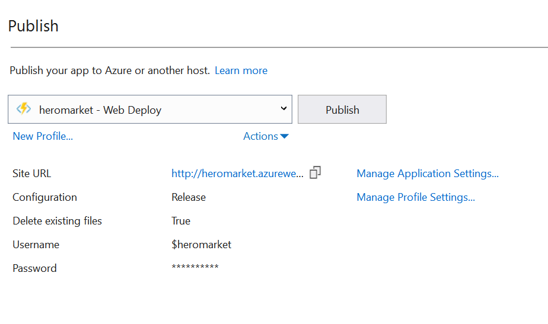
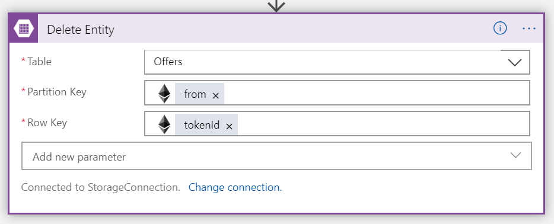

# Collect, battle and trade your heroes using Unity, Azure and Ethereum

This example show how easy it is for game developers to enable players purchasing assets on one platform to use them on all platforms with the power of Ethereum blockchain and Azure platform.

Hero example consists of:
- Simple game built using Unity and Nethereum allowing players to 
    - View their assets (heroes in this case) on all the platforms they are using
    - Acquire new assets using Unity IAP on every platform
    - Engage in automatic battles
    - Manage their keys
- Simplified ERC-721 non-fungible token (NFT) contract representing in-game assets (heroes)
- Logic App with Azure Function and Ethereum connector to mint new tokens wherever a player completes IAP on any of the platforms
- Simple player-to-player marketplace built using Azure Storage Table, Azure Functions, Logic Apps and Ethereum connector

Besides purchasing game assets directly from the game developers, when assets are represented as tokens on blockchain, we can easily allow player-to-player trades. This example also covers steps for building a simple marketplace using Azure Functions, Logic Apps, Azure Storage and Ethereum blockchain connector.

---

## Prerequisites  
1. Azure Account
2. Visual Studio or Visual Studio Code to develop and publish Azure Function
3. Unity3D game development platform

--- 

## Unity3D

### To open the project:
- Open Unity3D.
- Select open.
- Navigate to the repository folder on your machine.
- Select the client folder and press open.

### To create a new Scene with a scrollable list:
Consult the instructions in [this tutorial](https://unity3d.com/learn/tutorials/topics/user-interface-ui/intro-and-setup?playlist=17111).

Instead of buttons we use HeroCard prefabs, which have a HeroCard.cs script, and the scroll view's script is called CardScrollList.cs (added to the scroll view's Content) etc.

### Bottom Menu
Bottom menu has as many buttons as there is screens and is only used for navigation. We add a script called MenuScript to the main Canvas object and this script contains all of the functions that the buttons from the bottom menu need to call. It is added to the main Canvas, because it needs access to other scripts' functions.

CardScrollList.cs has functions for all screens that contain a scroll view in them, with each function reloading the contents of the scroll view.

HeroCard.cs determines what screen is it on and what action will its purchase button perform.

### Heroes Screen
This screen lists all the heroes from the current player's blockchain account.

### Store Screen
On this screen we show to the user 4 different products that they can buy for fiat currency. These are the transactions that go through the platform's store. We create the necessary data in the LoadStore function in CardScrollList.cs.

### Market Screen
On this screen we show all of the heroes belonging to other players that are available for purchase. For now, these can only be bought with Ether. We get the list of these offers with a GET request to the API that is called from LoadMarket() function in CardScrollList.cs.

### Settings Screen
On this screen we hide the scroll view and show the settings panel which contains 3 input fields with labels denoting what each field contains, and placeholders that are showing the current values. SettingsPanel has the SettingsScript.cs as its component and this script contains one function for each of the input fields that is called when its text changes, and a function to save the current values in input fields as new settings - the save function is called when the Apply button is pressed.

### Top Menu
Contains one label that shows the title of the current screen.

--- 

## IAP
The user will be able to buy a random hero for a specific price by performing a standard in app purchase for a fiat currency through their App Store account. After the purchase is successfully made call the logic app that will have the item minted and transferred to the user's blockchain account. 

### To setup IAP in Unity: 
Read the instructions in [this guide](https://unity3d.com/learn/tutorials/topics/ads-analytics/integrating-unity-iap-your-game).

A few things have to be done differently:
- Use the Purchaser.cs script from our repository instead the one from the guide. 
- Observe that it only creates non consumable products, and pay close attention to the ProcessPurchase function on line 173: 
    - The function is called after the purchase request has been processed on the platform's store and received back, so this is the spot where you will want to call the Logic App that will perform the blockchain transaction. To do this you make a POST request with which you send info about the purchase that you got back from the platform's store so that it can be verified, but also to note which type of hero should be minted depending on the product that you sold.
- Add Purchaser.cs script as a component to the HeroCard prefab.
- Make sure to call the function BuyNonConsumable, from the HeroCard.cs script when the Buy button is clicked.


--- 

## Smart Contract

1. Create a private Ethereum network
    - You can choose to create a private Ethreum POA network from scratch as described in [this guide](https://github.com/caleteeter/smartcontractdev/blob/master/example1-setup.md)
    - or use an existing template on Azure Marketplace
2. Deploy the `CrypticLegendsToken.sol` located in `contracts`
    - Deploy the smart contract to you Ethereum network by using truffle as described in [this guide](https://github.com/caleteeter/smartcontractdev/blob/master/walkthrough1.md) or by using [Remix IDE](https://remix.ethereum.org)
    - Take a note of the **contract address** and **ABI** as we will need them to connect to the smart contract
    - Take a note of the private key of the account


`CrypticLegendsToken` smart contract is a simplified version of the ERC-721 (non-fungible token) standard. In order for it to work with Ethereum connector, we have mashed OpenZeppelin implementation in single contract and removed indexed events.

`CrypticLegendsToken` defines `Character` struct with the following fields
```
struct Character {
    string name;
    uint8 wisdom;
    uint8 inteligence;
    uint8 charisma;
    uint8 speed;
    uint8 accuracy;
    uint8 might;
  }

```
Smart contract emits following events
```
- event Transfer(address from, address to, uint256 tokenId);
- event OwnershipTransferred(address indexed previousOwner, address indexed newOwner);

```

It exposes the following methods
- `safeTransferFrom` - Safely transfers the ownership of a given token ID to another address and should be used
- `transferFrom` - Transfers the ownership of a given token ID to another address - usage strongly discouraged
- `getTokenCount` - Returns total amount of toknes minted 
- `getToken` - Returns fields of the `Character` struct
- `mint` - for creating new `Character` tokens. Only owner is able to execute it
- `balanceOf` - Gets the balance of the specified address
- `ownerOf` - Gets the owner of the specified token ID.
- `tokenURI` - Returns an URI for a given token ID.
- `transferOwnership` - Allows the current owner to transfer control of the contract to a newOwner.
- `renounceOwnership` - Allows the current owner to relinquish control of the contract

---

## Create an Azure Function to generate characteristics for a new hero

1. Create a Function App from Azure Marketplace on Azure Portal
2. This time we will be using Visual Studio (or Visual Studio Code) to deploy custom-built Azure function. Open the `HeroFunctionsApp` solution and inspect `GenerateCharacteristics` function, which generates the abilities of a hero and return a JSON object
3. Publish to Azure Function from Visual Studio


4. Create publish profile by logging in with your account and selecting Azure function you created



--- 

## Create a Logic App to transfer the hero to player who purchased it through IAP

1. Create a new **Logic App** in Azure Portal and use Blank Logic App template. 
2. Select **When a HTTP request is received** trigger
3. Paste request body schema located in `logicapps\requestbodyschema.json` or use sample payload to generate request body JSON Schema

Additionally, you would want to verify the IAP has gone through. You can add steps to verify the receipt issued for each of the store by following a store guide eq. [Apple Store](https://developer.apple.com/library/archive/releasenotes/General/ValidateAppStoreReceipt/Chapters/ValidateRemotely.html)

4. Next, add **Azure Function** connector and select the `GenerateCharacteristics` function you created
5. Set **GET** as the method in the add new parameter dropdown


6. Add **Ethereum blockchain connector** and select **Execute smart contract function**
7. Create a new connection to Ethereum RPC endpoint
    - Enter a connection name
    - Put a RPC endpoint eq. `http://your_ip:port`
    - Paste a private key of the account from your Ethreum network
8. Paste **ABI** you stored earlier
9. Paste address contract has been deployed to
10. Select the `mintCharacter` function from the dropdown
11. In the boxes use dynamic content to fill in the parameters
- Select **buyer** for _to parameter
- Select **Name** for _name parameter
- Select **Wisdom** for _wisdom parameter
- Select **Inteligence** for _inteligence parameter
- Select **Charisma** for _charisma parameter
- Select **Speed** for _speed parameter
- Select **Accuracy** for _accuracy parameter
- Select **Might** for _might parameter


12. Save and run the logic app

--- 

# Simple P2P Marketplace

This example uses Azure Storage Table to represent available offers made by other players looking to sell their in-game assets.
Table contains
- Sellers address as PartitionKey
- Hero token Id as RowKey
- Asking price in ETH


## Create an Azure Function to list available offers

We will create an Azure function that will list all available offers

1. You can a new Function App or use existing defined in previous steps
2. Visual Studio (or Visual Studio Code) to deploy in the `HeroFunctionsApp`. Inspect `Offers` function, retrieves all entities in the `Offers` table and returns the list as JSON
3. Publish to Azure Function from Visual Studio


4. If you are using the same Azure Function, publish using the same profile


5. Note the URL of the published function and use it in your app

--- 

## Create an Azure Function to list offers from a specified player

To get all the assets a specific player is offering on sale, we have a function `UserOffers`.
Make sure to include user as query parameter with users address as a value.

--- 

## Create a Logic App to offer your heroes for sale on P2P marketplace

1. Create another **Logic App** in Azure Portal and start with a **When a HTTP request is received**
2. Paste request body schema located in `logicapps\sell-requestbodyschema.json` or use sample payload to generate request body JSON schema


3. Add new **Azure Storage Table** connector and select **Insert Entity** action
4. Fill the parameters as shown on the image


5. Save and run the logic app

---


## Create a Logic App to update the marketplace on P2P sale

Once a player completes a sale on Ethereum blockchain, we will want to remove the offer from our simple marketplace.

1. Create a new **Logic App** in Azure Portal and use Blank Logic App template
2. Add **Ethereum blockchain** connector and select **When a smart contract event occurs** trigger


3. Paste **ABI** you stored earlier
4. Paste address contract has been deployed to
5. Select the `Transfer` event from the dropdown


6. Add new **Azure Storage Table** connector and select **Delete Entity** action
7. Fill the parameters as shown on the image



8. Save and run the logic app

---

# Testing

To verify everything is working correctly:

- Follow the instructions in [this guide](https://unity3d.com/learn/tutorials/topics/mobile-touch/building-your-unity-game-ios-device-testing) on how to build your game on an iOS device in order to test it.
- Follow the instructions in [this guide](https://www.raywenderlich.com/5456-in-app-purchase-tutorial-getting-started) to setup basics on your iTunes connect. 


## Important
When you create products on iTunes connect, for in app purchase, make sure that they have the same values as these:
public static string NonConsumableBronze = "randomBronzeHero";
public static string NonConsumableSilver = "randomSilverHero";
public static string NonConsumableGold = "randomGoldHero";
public static string NonConsumableLegendary = "randomLegendaryHero";
- (Purchaser.cs, line 10.)

